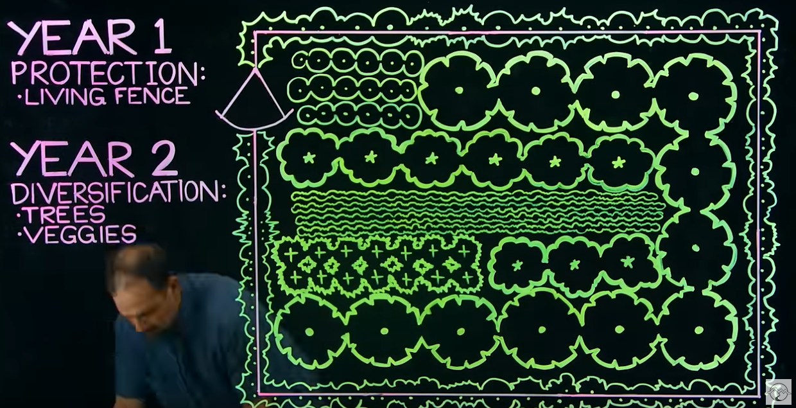

- Grafisch
- Key points was das System macht

## Tinder für Vereine
### Use cases
- Vereine tragen sich ein
- (Potenzielle) Spender füllen einen Fragebogen aus/swipen Vereine und können Filterkriterien einstellen
- System berechnet bestes "match" und zeigt Details zu Organisationen

### Komponenten
- Benötigt einheitliche Darstellung für verschiedenste Vereine mit Logo, Name, Fokus, Zertifizierungen, erledigte & geplante Projekte, Organisationsstruktur, Größe, Bilder, Videos, Testimonials, Übersicht über mögliche Abos, eventuelle Belohnungen, ...
- Übersicht über Persönliches Spendenprofil, eventuell sogar mit Leaderboard?

## Tracking und Transparenz

- Generierte Jahresberichte
- Verfolgung von (einzelnen) Spenden
    - Verschiedene Ansichten mit variierender Detailtiefe
- Verschieden graphische Darstellungen
	- Sankey-Diagramm
	- Kuchen-Diagramm
    - ...
- Optional: Individualisierte Benachrichtigungen

## Spiel mit In-App-Käufen

### Educational mit Vorstellung von Vereinen
- [Permaculture](https://en.wikipedia.org/wiki/Permaculture)
- Bauen eines Mini-Ökosystems mit Erklärungen im Spiel
    - Garten
    - Wald
    - See
    - Verschiedene Klimazonen
    - ...
- Bei der Planung die Bedürfnisse der Menschen vor Ort mit einbeziehen
    - [Green Wall](https://thegreatgreenwall.org/about-great-green-wall)
    - [Earth Smiles](https://justdiggit.org/what-we-do/landscape-restoration/water-bunds/)
    - Erläuterungen zu den echten lokalen Gegebenheiten
- Vereine, die thematisch nah sind vorstellen ggf. Option zum Spenden
- Alternativ:
- Start des Spiels auf einem Globus
    - Verschiedene Orte auf dem Globus sind als Bauort auswählbar
    - Die Gegebenheiten sind an die echten vor Ort angepasst
    - Vereine, die in der Umgebung tätig sind werden der Spielguide, mit Verweisen auf die echten Aktivitäten
- Potentiell Modus für Gruppen bsp. Schulklassen

#### Sources

- [Educational Infos](https://www.youtube.com/watch?v=1LCTVO_Y5Rs)
- 
