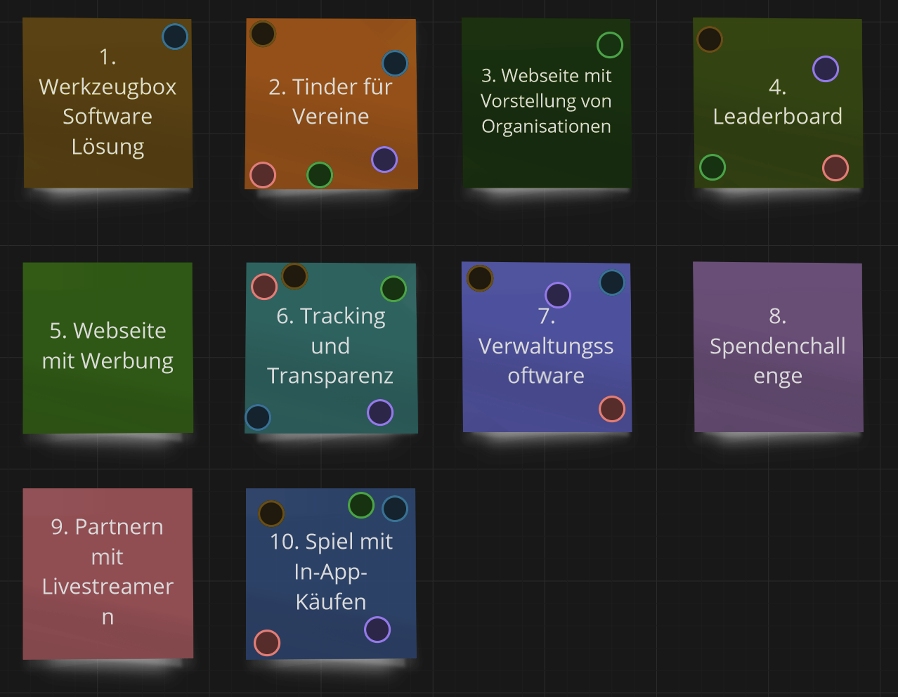

# Ideen für ein Projekt Thema

1. "Pass partout" Software Lösungen für verschiedene Plattformen die miteinander interagieren können. Damit Vereine dann nur noch die graphischen Feinheiten per Klicky Bunty ausarbeiten müssen um so den einzelnen Aufwand zu reduzieren und trotzdem eine gewisse Individualität zu erhalten.

2. Suchmaschine für Spendende um Vereine anhand von diversen Kriterien leicht finden zu können und in dessen Pool Vereine von einer Trusted Organisation eingetragen werden z.b. der Staat.
    - "Tinder für Vereine und Spender"

3. Website, auf der verschiedene Organisationen vorgestellt werden
    - Organisationen erhalten einen Seriösitäts/...-Score
    - Unabhängige Zertifizierungen werden gezeigt
    - Es wird angezeigt, wie viel Prozent der Spende für den Zweck verwendet wird (also wie viel nicht für Verwaltung, ... verwendet wird)

4. Ein Leaderboard mit
    - Badges für das Spenden an spezifische Projekte.
    - (Optional) Namentliche Nennungen.
    - Anzeige, in welchem Umkreis man der Top Spender ist, z.B. im eigenen Dorf, im Bezirk, ...
        - Achtung: Identifikation von Großspendern darf nicht möglich sein.

5. Webseite mit Werbung
    - Anwendung, in der man durch Werbung schauen Einnahmen generiert, die dann gespendet werden.
    - Website auf der man eine Werbung nach der anderen anschauen kann, mit dem Ziel durch aktives Werbung schauen Geld für die gemeinnützige Organisation zu generieren.

6. Tracking + Transparenz
    -  Anwendung (Website?) bei der man sich durch verschiedene Layer an Detailtiefe w.r.t. Transparenz klicken kann. Referenz auf die Verfolgung von einzelnen Spenden und generellem Überblick
    - Tracking + Übersicht über den Eingang + Verteilung von Spenden, in der man genau sehen kann was mit welchem Geld gekauft wurde, inklusive Dokumentation in Form von Bildern, Videos, Testimonials, Zeitraffern (falls möglich), damit man sieht was genau passiert ist. + Individualisierte Benachrichtigungen, wenn Geld ausgegeben wurde, das man selbst gespendet hat.
    - Spendentracker
        - Sowohl Verfolgung von Einzelspenden als auch Generierung eines Jahresberichts
    - Trackingsystem für die Gespendeten Euros, ermöglicht optional Direktes Feedback an die Spender
        - Geld-Queue, jede Spende landet in der Queue, jede ausgabe entnimmt Spende(n) aus der Queue => zuordnung von Spende zu Ausgabe
    - easyverein extension mit der einfach Sankey-Diagramme zu Ein/Ausgaben erzeugt werden können.
    - Eine App für genaue Informationen zu Projekten, Veranstaltungen, etc.

7. Verwaltungssoftware
    - System zur automatischen Erstellung von Jahresberichten und anderen Dokumenten (z.B. Spendenquittungen) aus existierenden Dokumenten (z.B. Bankauszüge).
    - Ein Buchhaltungsapp, um Ausgaben auch mit Bildern zu dokumentieren. Kann möglicherweise auch in einem Foto gekaufte Sachen erkennen und auf Rechnungen mappen.

8. Spendenchallenge
    - Leaderboard, auf dem (Unternehmen) gerankt werden, wie viel sie innerhalb der Spendenchallenge gespendet haben
    - Competition: Jedes Unternehmen will besser dastehen als die Konkurrenz

9. Partnern mit Livestreamern, für Spenden-Streams
    - [Beispiel](https://de.wikipedia.org/wiki/Friendly_Fire_(Charity-Livestream))

10. Ein Spiel in dem man durch kleinere Transaktionen Vorteile/Skins/... erhalten kann, wobei der Gewinn als Spende verwendet wird.

## Post-It voting

## Winner

- Tinder für Vereine
- Tracking und Transparenz
- Spiel mit In-App-Käufen
